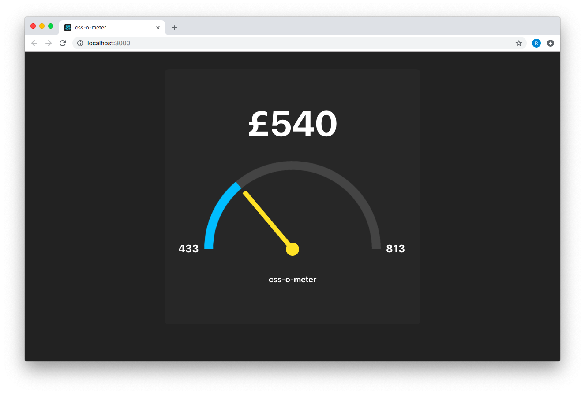
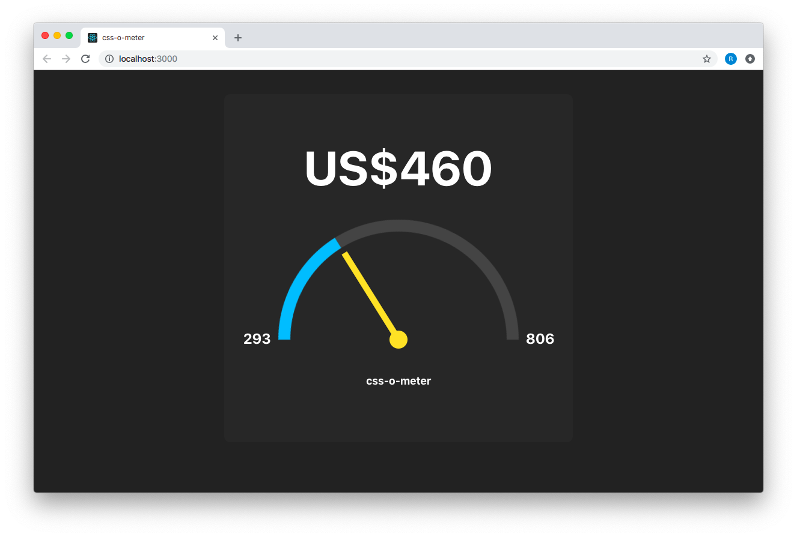
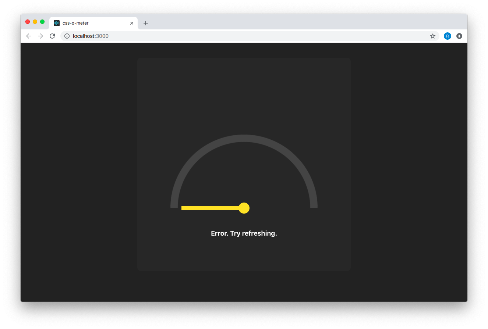

# Micro dash

Demo: https://rpemberton.github.io/micro-dash

* Supports multiple currencies
* Uses CSS animations
* Easy to add more Widgets

## Notable components

### Dashboard
This is responsible for the main theme, layout of Widgets, and fetching data.

### Widget
This component wraps up a chart or some other component/element and makes it compatible with the Dasboard.

### Meter
This takes some data as props and renders a dashboard style meter.

## States

### Success

### Loading

### Error

## Develop

* Get started: `npm install && npm start`
* Test: `npm run test`
